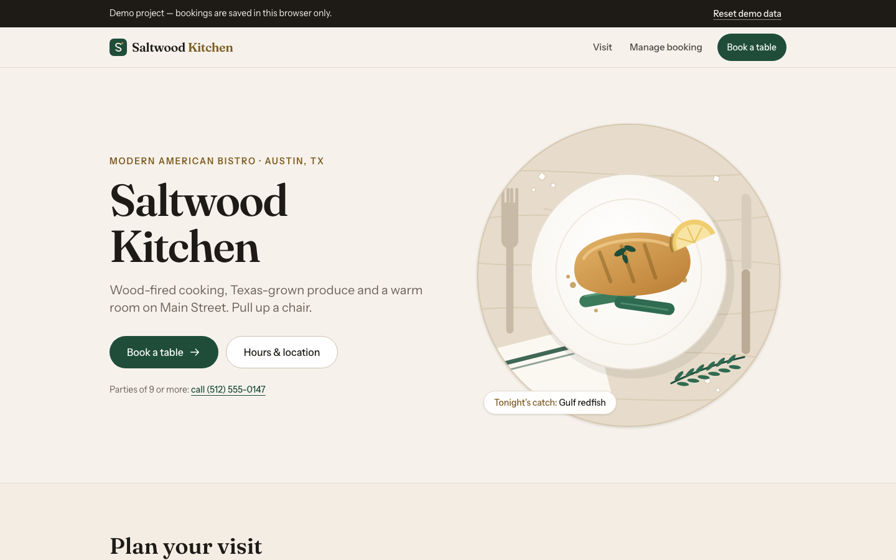
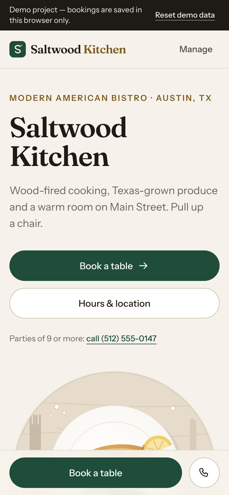
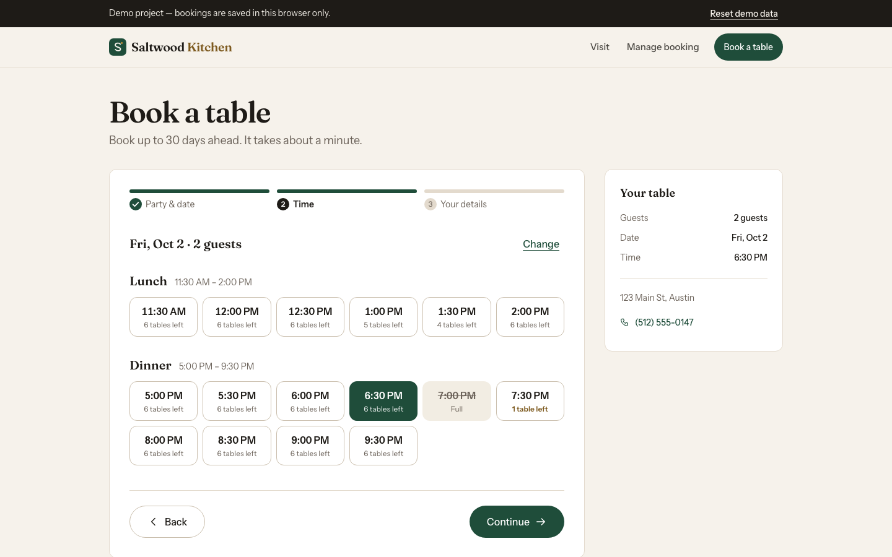
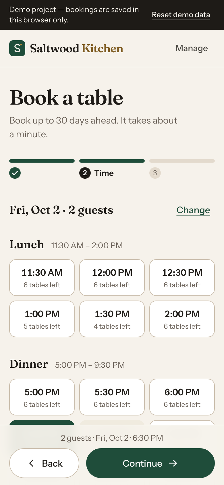
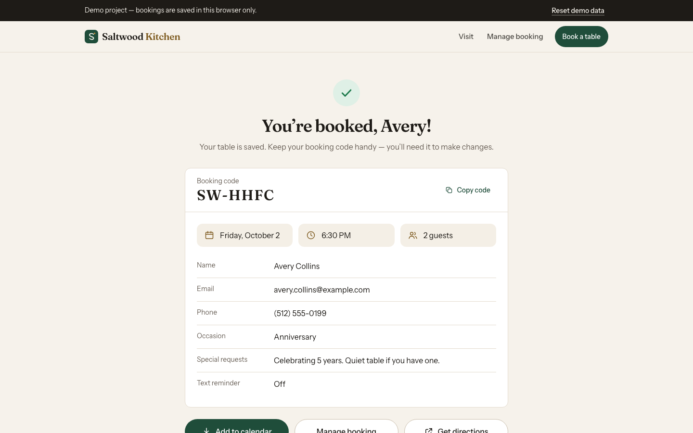
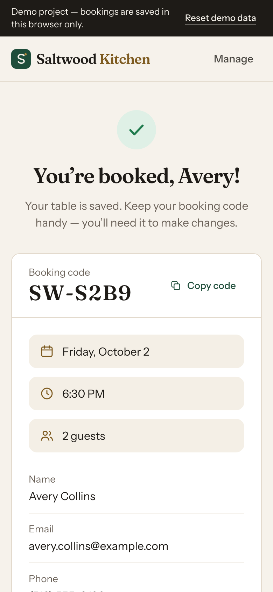
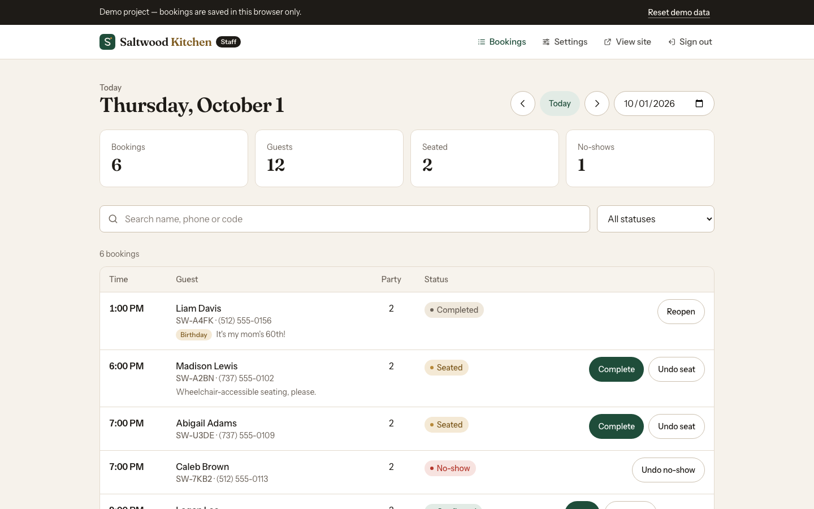
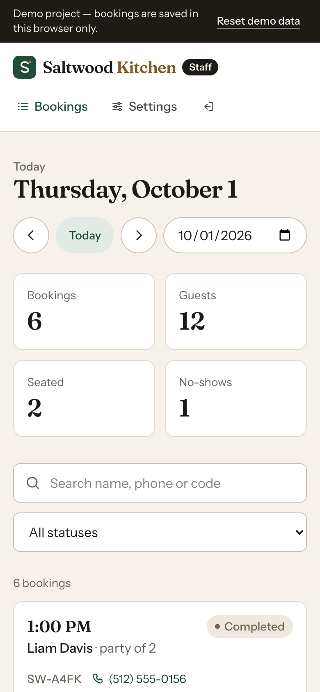

# Saltwood Kitchen — Table Booking

A production-quality restaurant booking web app for **Saltwood Kitchen**, a (fictional) modern American bistro at
123 Main St, Austin, TX. Guests book a table in three steps on any phone, get a confirmation code and a calendar invite,
and can reschedule or cancel on their own. Staff get a dashboard for the day's service and a settings screen for hours,
capacity and closures.

**Live demo:** https://saltwood-kitchen.vercel.app

It runs end to end with **no backend, no database and no API keys**: data lives in the browser behind a repository
interface, so it can be swapped for Supabase (or any API) without touching UI code.

> **Demo project.** Bookings are saved in the browser you make them in. The staff area uses a demo passcode (`2468`)
> and is **not** real security — see [Demo-only auth](#demo-only-auth).

## Screenshots

| Desktop | Mobile |
| --- | --- |
|  |  |
|  |  |
|  |  |
|  |  |

Regenerate them any time with `npm run screenshots`.

## Features

**For guests**

- **Home page** with hours (read live from settings, including an "open now" status), location with directions,
  signature dishes, an about section and a sticky "Book a table" bar on phones.
- **3-step booking flow** with a step indicator and Back buttons:
  1. Party size (1–8; 9+ is asked to call, with a tap-to-call link) and date (today plus the next 30 days; closed and
     fully booked days are disabled). Phones get a swipeable day strip, larger screens a month calendar.
  2. Time, grouped into Lunch and Dinner, with live availability ("2 tables left"). Full and past times are disabled.
  3. Guest details with inline validation: name, email, US phone (auto-formatted), occasion, special requests
     (200-character counter) and an SMS reminder opt-in (UI only).
- **Availability is re-checked on submit.** If someone else took the slot meanwhile (for example in another tab), the
  guest sees "That time was just booked. Please pick another time." and returns to step 2 with everything else kept.
- **Confirmation page** with a booking code (`SW-XXXX`, no look-alike characters such as 0/O or 1/I), a summary,
  **Add to calendar** (an `.ics` file generated in the browser), Manage booking and Get directions.
- **Manage booking**: look up by code + email, reschedule with the same pickers and rules (the booking's own table
  doesn't count against it), or cancel through a confirmation dialog. Cancelling frees the table right away.

**For staff (demo)**

- **Dashboard**: day switcher (previous / today / next / date picker), summary cards (bookings, guests, seated,
  no-shows), search by name, phone or code, status filter, and one-tap status changes (Seat, Complete, No-show,
  Cancel, Restore). A table on desktop, stacked cards under 768px.
- **Settings**: opening hours per weekday (closed toggle plus lunch and dinner windows), slot interval (15/30 min),
  tables per slot, max party size and blackout dates. Changes apply to online booking immediately.

**Everywhere**

- Demo banner with **Reset demo data**, and about 40 realistic sample bookings generated relative to today, so the demo
  never looks stale.
- All times are restaurant time (America/Chicago), whatever time zone the visitor is in. US formats throughout:
  "Fri, Oct 9", "6:30 PM", "(512) 555-0147".
- If localStorage is blocked or full, the app falls back to in-memory storage and says so. Corrupted data is detected
  (validated with zod), re-seeded and reported. Changes sync across open tabs.

## Tech stack

- [Next.js 16](https://nextjs.org) (App Router, Turbopack) + React 19 + TypeScript (strict)
- [Tailwind CSS v4](https://tailwindcss.com) — design tokens live in `app/globals.css` (`@theme`)
- [react-hook-form](https://react-hook-form.com) + [zod](https://zod.dev) for forms and validation
- [date-fns](https://date-fns.org) for date math and formatting; `Intl` for the restaurant's time zone
- [Vitest](https://vitest.dev) for unit tests, [Playwright](https://playwright.dev) for end-to-end tests and screenshots
- Fonts: Fraunces (headings) and Instrument Sans (body) via `next/font`

## Getting started

Requires **Node.js 20.9 or newer** (Node 24 LTS recommended).

```bash
npm install
npm run dev
```

Open http://localhost:3000. The staff dashboard is at http://localhost:3000/admin (passcode `2468`).

### Scripts

| Script | What it does |
| --- | --- |
| `npm run dev` | Start the development server |
| `npm run build` | Production build |
| `npm run start` | Serve the production build |
| `npm run lint` | ESLint (Next.js core web vitals + TypeScript rules) |
| `npm run typecheck` | Generate route types, then `tsc --noEmit` |
| `npm run test` | Unit tests (Vitest) |
| `npm run test:e2e` | End-to-end tests (Playwright) against a production build |
| `npm run screenshots` | Build, start and save desktop + mobile PNGs to `/screenshots` |

## Testing

**Unit tests** cover every booking rule in `lib/availability.ts` (closed days, blackout dates, past slots, the
30-minute lead time, full slots, cancellations freeing a table, rescheduling excluding the booking's own table,
the booking window and party size) plus the booking code format, the repository (including a second tab taking the last
table, corrupted data and blocked or full storage), seed data, hours, the `.ics` file and time-zone/DST handling.

```bash
npm run test
```

**End-to-end tests** run in Chromium against a production build, with the browser deliberately set to a time zone far
from Austin:

- the full flow: book → confirm → download `.ics` → find in Manage → reschedule → cancel → see it in the dashboard,
  including the "that time was just booked" path;
- a layout sweep of every page at **360, 390, 414, 768, 1024 and 1440 px**: no horizontal scrolling, every touch target
  at least 44×44 px, every form field at least 16px (so iOS doesn't zoom), and no failed requests or page errors.

The first run needs Playwright's browser:

```bash
npx playwright install chromium
```

```bash
npm run test:e2e
```

## Deploy to Vercel

The app needs no environment variables or configuration.

1. Push this folder to a GitHub, GitLab or Bitbucket repository.
2. In Vercel, choose **Add New → Project** and import the repository. The Next.js preset is detected automatically.
3. Click **Deploy**.

Optional: set `NEXT_PUBLIC_SITE_URL` (for example `https://saltwoodkitchen.com`) so canonical URLs, the sitemap and
Open Graph tags use your custom domain. Without it, Vercel's production URL is used.

## Project structure

```
app/
  (site)/              Public pages: home, /book, /book/confirmation/[code], /manage
  admin/login/         Staff sign-in
  admin/(protected)/   Dashboard and settings, behind the demo guard
  error.tsx, not-found.tsx, opengraph-image.tsx, robots.ts, sitemap.ts, icons
components/
  booking/  home/  manage/  admin/  layout/  ui/
lib/
  availability.ts      Booking rules as pure functions
  storage/             Repository interface, localStorage implementation, fallbacks
  schemas.ts           zod schemas for bookings, settings and forms
  seed.ts              Sample data relative to today
  time.ts, hours.ts, ics.ts, bookingCode.ts
public/art/            SVG illustrations (placeholders for real photos)
tests/                 Vitest unit tests
e2e/                   Playwright flow, layout and screenshot specs
```

### Customizing

- **Restaurant details** (name, address, phone, dishes): `lib/restaurant.ts`
- **Default hours and capacity**: `lib/settings.ts`
- **Colors, radius, fonts**: `app/globals.css` and `app/layout.tsx`
- **Photos**: the illustrations in `public/art/` are plain SVG files. Replace them with real photos (and switch the
  `src`), and `next/image` will optimize them.

## How to connect a real database

All data access goes through one interface, `BookingRepository` in `lib/storage/bookingRepo.ts`. It is already async,
so a network-backed version is a drop-in replacement:

```ts
// lib/storage/index.ts — the only line UI code depends on
export const bookingRepo: BookingRepository = createSupabaseBookingRepository(supabase);
```

A Supabase version would look like this:

**1. Tables**

```sql
create table settings (
  id int primary key default 1 check (id = 1),
  data jsonb not null            -- same shape as the Settings zod schema
);

create table bookings (
  id uuid primary key default gen_random_uuid(),
  code text not null unique check (code ~ '^SW-[ABCDEFGHJKMNPQRSTUVWXYZ23456789]{4}$'),
  date date not null,
  time time not null,
  party_size int not null check (party_size between 1 and 20),
  first_name text not null,
  last_name text not null,
  email text not null,
  phone text not null,
  occasion text not null default 'none',
  special_requests text not null default '' check (char_length(special_requests) <= 200),
  sms_reminder boolean not null default false,
  status text not null default 'confirmed'
    check (status in ('confirmed', 'seated', 'completed', 'no_show', 'cancelled')),
  created_at timestamptz not null default now(),
  updated_at timestamptz not null default now()
);

create index bookings_slot on bookings (date, time) where status <> 'cancelled';
```

**2. Make the capacity check atomic.** In the browser version the re-check and the save happen in one synchronous step.
With a database, two guests can submit at the same moment, so do the check and insert inside one transaction:

```sql
create function create_booking(p jsonb) returns bookings
language plpgsql security definer as $$
declare
  tables int;
  taken int;
  result bookings;
begin
  -- Serialize bookings for the same slot.
  perform pg_advisory_xact_lock(hashtext((p->>'date') || ' ' || (p->>'time')));
  select (data->>'tablesPerSlot')::int into tables from settings where id = 1;
  select count(*) into taken from bookings
    where date = (p->>'date')::date and time = (p->>'time')::time and status <> 'cancelled';
  if taken >= tables then
    raise exception 'slot_full';
  end if;
  insert into bookings (code, date, time, party_size, first_name, last_name, email, phone,
                        occasion, special_requests, sms_reminder)
  values (p->>'code', (p->>'date')::date, (p->>'time')::time, (p->>'partySize')::int,
          p->>'firstName', p->>'lastName', p->>'email', p->>'phone',
          p->>'occasion', p->>'specialRequests', (p->>'smsReminder')::boolean)
  returning * into result;
  return result;
end $$;
```

Run the same rules from `checkSlotBookable()` (hours, blackout dates, lead time) on the server too, for example in the
function above or in a Next.js Server Action. Map the `slot_full` error to `BookingUnavailableError("full")` so the UI
shows the same "That time was just booked" message.

**3. Implement the interface.** Each method becomes a query or RPC call (`createBooking` → `rpc("create_booking")`,
`findBookingForGuest` → an RPC that requires both code and email). Convert column names to the camelCase `Booking`
shape and validate responses with the existing zod schemas. `subscribe` can use Supabase Realtime so the dashboard
updates live.

**4. Lock it down.** Enable row-level security, give anonymous users access only to the RPCs (never direct reads of
`bookings`), and replace the demo staff passcode with Supabase Auth.

## Demo-only auth

The staff area (`/admin`) is protected by a passcode (`2468`, shown on the sign-in page) and a flag in
`sessionStorage`. **This is not security**: the passcode ships in the JavaScript bundle and the flag can be set by hand.
It exists so the demo has a staff area to click through. Before handling real guest data, use real authentication and
enforce access on the server (see step 4 above). Likewise, the confirmation page is reachable by booking code alone,
which is fine for a demo but should use a signed link in production.

## Accessibility and quality

- Semantic HTML with real buttons, links and labels; visible focus styles; a skip link.
- Date, party size and time pickers are native radio groups, so arrow keys work and unavailable options are skipped.
- Dialogs use the native `<dialog>` element with a focus trap, Esc to close and focus returned to the trigger.
- Form errors are linked with `aria-describedby` and announced through live regions.
- Colors meet WCAG AA contrast; the brand gold is darkened for text (`accent-ink`).
- Motion is limited to showing what changed and is turned off for `prefers-reduced-motion`.
- Lighthouse (mobile): Accessibility, Best Practices and SEO score 100 on the home, booking and manage pages. Measure
  performance on your deployment with [PageSpeed Insights](https://pagespeed.web.dev), since local results depend on
  the machine running them.
